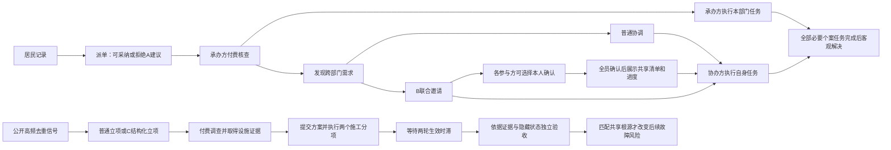

# 业务任务图、权限与计量口径（1.2）

本文是`policy_mve/core.py`及`spec.py`的阅读索引。合成参数的精确值以运行快照为准，不将这些值解释为北京实测值。

## 对象与任务依赖

| 对象 | 用途 | 不可混同 |
|---|---|---|
| Issue | 设施上一次客观故障episode | 催办次数、工单办结 |
| Ticket | 居民可见记录、分派及个案任务清单 | 独立新增故障 |
| Facility | 设施状态、隐藏依赖及根源 | 主体免费获得的知识 |
| Topic | 同片区和类别的公开去重信号 | 共同根因已被证实 |
| Project | 调查、方案、施工、时滞和验收记录 | 既有局部故障自动解决 |
| Resource ledger | 劳动、工程资金与每轮施工容量 | API人民币费用 |

图中B邀请后仍能走普通办理；确认不构成维修前提，也不会为B加速。B只作用于个案，图右侧专项内部规则不读取B标签。方案检查、资源支付与最终验收由环境规则执行，第一版没有另设方案评审或施工谈判主体。

## 模型可见权限

| 主体 | 允许观察 | 可执行动作 | 禁止读取 |
|---|---|---|---|
| 派单员1 | 公开工单、职责目录、A建议 | 派至2或3、等待 | 隐藏真实承办答案、设施根源、客观评分 |
| 供水办理2 | 自身承办及已协调分配工单、已付费取得的任务需求、自己的任务状态、合法联合邀请/已激活共享板 | 核查、申请协调、本人确认、本人工作、等待 | 未合法取得的其他工单调查和隐藏根源 |
| 基础设施办理3 | 与2对称的角色白名单 | 与2对称 | 与2相同 |
| 专项负责人4 | 公开居民记录和高频信号、自己项目的付费调查证据、方案及进度 | 立项、调查、实施、验收、等待 | 未经调查的真实资产拓扑、隐藏客观状态 |
| 独立派单建议器 | 当前工单文本/类别及职责目录 | 输出候选、依据、不确定性 | 角色历史、隐藏正确答案、完整world |
| 主管理员/验证器 | 完整审计状态、事件、资源账本 | 存档、指标复算、动作重放 | 不把审计状态传入模型观察 |

身份由程序绑定，动作不能自报替代他人身份、资源或政策标签；模型没有文件系统及管理员查询工具。每个角色还可看到自身剩余劳动和共同工程容量。观察字典按字段白名单构造并有隐藏状态不变性测试。

每个主体还能看到本人上一轮结算回执`last_receipt`：轮次、执行/拒绝状态、原因码、动作类别及目标、本人劳动/资金/施工容量扣款。初始无回执时为null，不展示其他人的审计日志。公开工作流只解释既有合法顺序，不能替代付费调查。

## 动作费用与结果条件

下表为本轮合成资源单位。每项非等待动作还支付0.1决策劳动；失败尝试可能已耗用决策劳动，不能视为无成本尝试。

| 动作 | 额外劳动 | 工程资金/施工容量 | 可更新的状态 |
|---|---:|---|---|
| 派单 | 0.5；用A建议再加0.2 | 无 | 承办方、建议采用记录 |
| 个案核查 | 1 | 无 | 暴露任务依赖；形成B机会 |
| 申请协调 | 1；B联合邀请再加0.5 | 无 | 协办权限、邀请参与集合 |
| 本人联合确认 | 0（另有0.1决策劳动） | 无 | 本人确认；全部确认后激活共享板 |
| 个案工作 | 1 | 0.5资金、1施工容量 | 本部门任务完成；全部任务满足才解决Issue |
| 立项 | 1；C结构化立项再加0.5 | 无 | 项目及关联设施 |
| 专项调查 | 2 | 无 | 合法可见的资产调查证据 |
| 每次专项施工 | 2 | 3资金、1施工容量 | 两个必要分项中的一个 |
| 专项验收 | 0.5 | 无 | 时滞已满且方案匹配才修复共享根源；否则失败 |

每主体劳动预算100，共同工程资金24，每轮共同施工容量2；角色2/3/4的结算顺序按轮次轮换，不由API返回速度决定。施工容量按轮恢复，劳动与工程资金不补充。专项和个案共用这些约束。

## 机会、采用与结果

| 工具 | 适用机会/提供分母 | 采用 | 完成与结果 |
|---|---|---|---|
| A | 去重初次工单 | 带`use_recommendation=true`的已执行派单 | 派单执行、初次分派匹配、使用者客观问题解决分别记 |
| B | 核查发现跨部门需求或职责不匹配的工单 | 已执行joint邀请 | 另列确认人次/全员确认案件；个案任务全部完成与全员确认且解决分开记 |
| C | 6轮窗口至少3个公开去重episode，非活动项目且结束后冷却6轮 | 已执行structured立项 | 验收通过才记完成；未来问题差异才可用于探索预防，不能由验收数推算 |

`used`不等于`fully_confirmed_cases`，工单关闭不直接改变Issue。零分母记null/NA。主指标累计各轮行动结算后的未解决Issue；下一轮新故障从下一轮计入。时间单位是合成轮次；费用表的资源单位与API人民币不相加。
